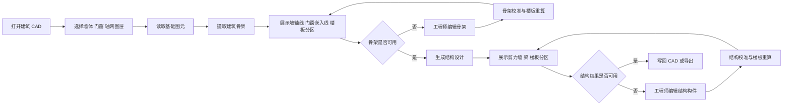

# 用户交互流程

## 总流程

## 阶段 1：准备输入

### 用户动作

1. 打开建筑平面图。
2. 选择墙体图层。
3. 选择门窗图层。
4. 选择轴网图层。
5. 点击“提取骨架”。

### UI 应显示

- 当前选择的图层名。
- 每类图层读取到的图元数量。
- 读取失败或图层为空的提示。

### 业务接口

- UI 读取基础图元。
- 调用 `extract_skeleton`。

## 阶段 2：检查和修正骨架

### 自动结果

- 墙轴线。
- 墙厚。
- 门窗嵌入线。
- 轴网线。
- 楼板分区。
- 诊断信息，如未闭合区域、门窗识别数量。

### 用户重点检查

- 墙轴线是否落在正确位置。
- 门窗洞口是否遗漏或方向错误。
- 楼板分区是否出现明显缺失，借此判断骨架是否未闭合。

### 必要编辑能力

- 新增、删除、移动墙轴线。
- 修改墙厚。
- 新增、删除、移动门窗嵌入线。
- 开关显示楼板分区和轴网线。
- 将修改后的骨架重新校准。

### 业务接口

- 调用 `normalize_skeleton`。

## 阶段 3：生成结构结果

### 用户动作

1. 点击“确认骨架”。
2. 点击“生成结构布置”。

### 自动结果

- 剪力墙。
- 外轮廓边梁。
- 阳台过梁。
- 连梁。
- 板划分梁。
- 楼板分区。

### 业务接口

- 调用 `design_structure`。

## 阶段 4：检查和修正结构结果

### 用户重点检查

- 剪力墙是否过长、过密、遗漏或不合理。
- 梁是否闭合、是否有悬垂梁。
- 阳台、外围窗边、连梁位置是否合理。
- 大板是否被合理划分。

### 必要编辑能力

- 新增、删除、移动剪力墙。
- 缩短或延长剪力墙。
- 新增、删除、移动梁。
- 修改梁类型。
- 重新计算楼板分区。

### 业务接口

- 调用 `normalize_structure`。

## 阶段 5：输出

### 输出内容

- 剪力墙线。
- 梁线。
- 可选的骨架线。
- 可选的诊断标记。

### 输出方式

- 写回当前 CAD 图层。
- 导出为后续结构建模可使用的数据。
