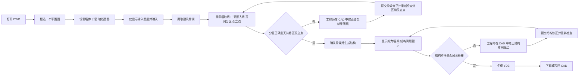

# 用户交互流程

## 总流程

## 阶段 1：限定操作对象

### 用户动作

1. 在 CAD 中打开一张 DWG。
2. 使用插件按钮“框选平面图”选择一个完整平面图。

### 设计原因

一个 DWG 中可能包含多个平面图、详图或说明文字。框选范围用于限制后续读取图元和写入结果，避免跨图误处理。

### UI 应显示

- 当前框选范围边界。
- 当前任务状态：未选择范围 / 已选择范围。

## 阶段 2：设置输入图层

### 用户动作

1. 点击“设置图层”。
2. 在弹窗中分别选择墙体、门窗、轴线图层。
3. 点击“仅显示输入图层”检查选择是否正确。
4. 如有需要，用户在 CAD 中清理或调整原图层显示。

### 图层设置弹窗

| 字段 | 控件 |
| --- | --- |
| 墙体图层 | 多选下拉框 |
| 门窗图层 | 多选下拉框 |
| 轴线图层 | 多选下拉框 |
| 操作 | 确定、取消、仅显示选择图层 |

## 阶段 3：提取和迭代修正骨架

### 用户动作

1. 点击“提取骨架”。
2. 前端读取框选范围内的墙体、门窗、轴线图层元素。
3. 前端调用 `extract_skeleton`。
4. 后端返回墙体轴线、门窗嵌入线、房间分区和 `isolated_points`。
5. 前端把结果绘制到新的结果图层上。
6. 前端将每个 `isolated_points` 坐标绘制为骨架诊断标记，用户结合房间分区判断骨架是否闭合。
7. 如有问题，用户直接在 CAD 中修改结果图层上的线段。
8. 点击“提交骨架修正”。
9. 后端调用 `normalize_skeleton` 重新生成分区和孤立点标记。
10. 重复检查和修正，直到骨架可用。

### 前端绘制结果

| 结果 | 用途 |
| --- | --- |
| 墙体轴线 | 建筑墙体骨架 |
| 门窗嵌入线 | 洞口位置 |
| 房间分区 | 判断骨架是否闭合 |
| 孤立点标记 | 使用 `isolated_points` 标识悬垂端点，提示用户补线或调整连接 |

### 判断重点

- 某个房间没有形成分区，通常说明某处骨架未闭合。
- 存在孤立点时，优先检查其相邻线段是否遗漏连接；每次提取或校正返回新结果后都应覆盖旧标记。
- 分区形状明显异常，通常说明某条墙轴线或洞口线位置不准。
- 用户修改的是结果图层，不需要重新从原始图层提取。

## 阶段 4：生成结构布置

### 用户动作

1. 点击“确认骨架”。
2. 点击“生成结构”。
3. 前端把最终骨架传给后端。
4. 后端调用 `design_structure`。
5. 前端绘制剪力墙、梁和结构分区。

### 前端绘制结果

| 结果 | 颜色建议 |
| --- | --- |
| 剪力墙 | 红色 |
| 梁 | 黄色 |
| 楼板分区 | 半透明多色填充 |
| 结构问题提示 | 高亮圈选或警告标记 |

## 阶段 5：检查和迭代修正结构

### 用户动作

1. 检查剪力墙和梁是否合理。
2. 检查前端提示的未闭合、未搭接或悬垂构件。
3. 用户直接在 CAD 中修改剪力墙和梁结果图层。
4. 点击“提交结构修正”。
5. 后端调用 `normalize_structure` 检查搭接并重新分区。
6. 如仍有问题，前端继续定位提示，用户继续修正。

### 后端应返回的检查信息

- 未搭接构件位置。
- 仍然悬垂的梁端。
- 无法形成楼板分区的位置。
- 结构构件数量和分类统计。

## 阶段 6：生成和下载模型

### 用户动作

1. 结构检查通过后，点击“生成 YDB”。
2. 后端根据最终结构构件调用 YJK 接口生成模型文件。
3. 前端提示生成完成。
4. 用户点击“下载 YDB”或“写回 CAD”。

### 输出

- YJK 模型 `ydb` 文件。
- CAD 中的剪力墙和梁结果图层。
- 可选的诊断报告。
